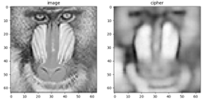
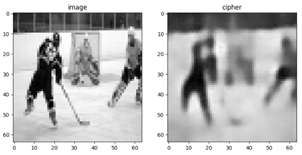
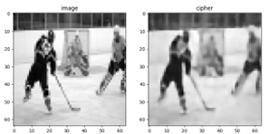

# CNN_SEGI

This is a legacy repository, storing my machine-learning attempt in Spring 2022. The code uses ImageNet and MNIST datasets, generating the optimized "patterns" for ghost imaging. Below are some sample test runs. The detailed recording (scratch) is stored in `Record - E.pptx`. 

